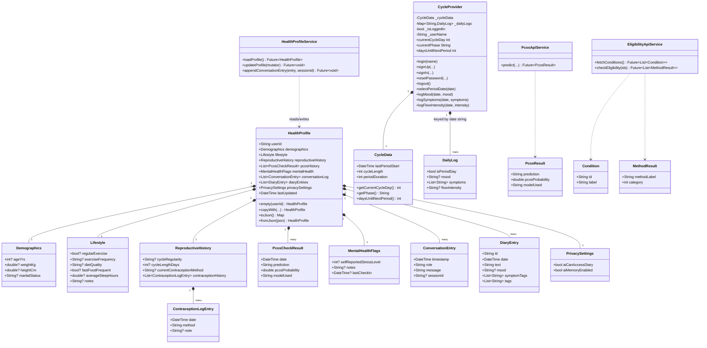
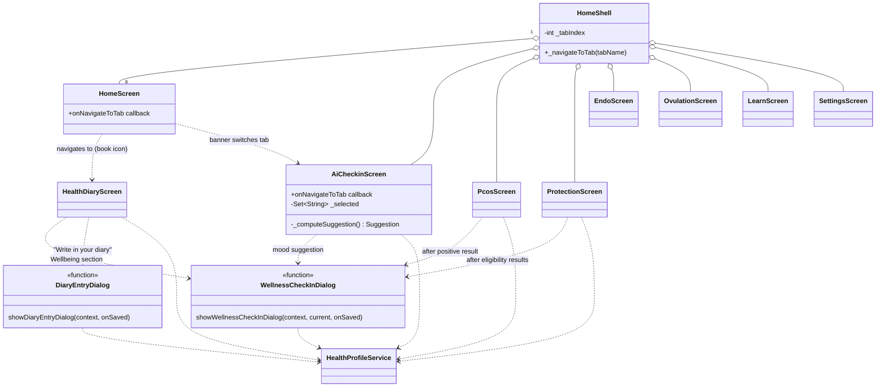
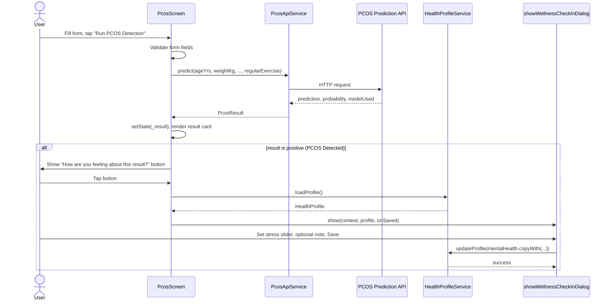
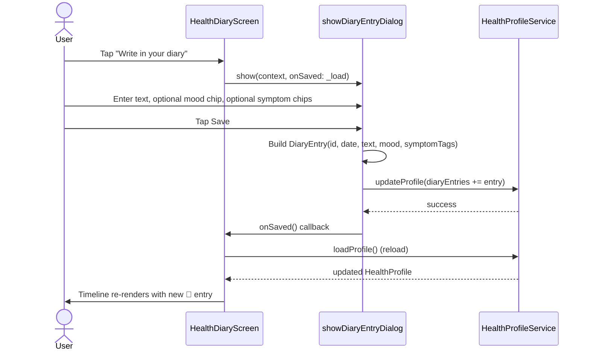
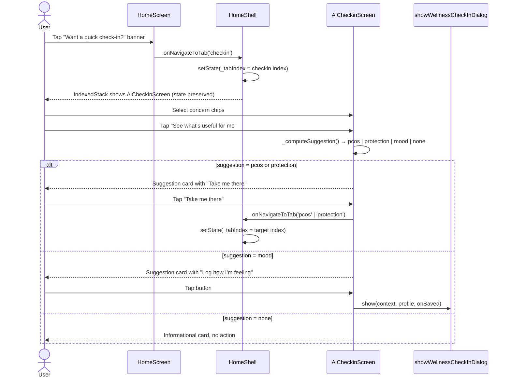
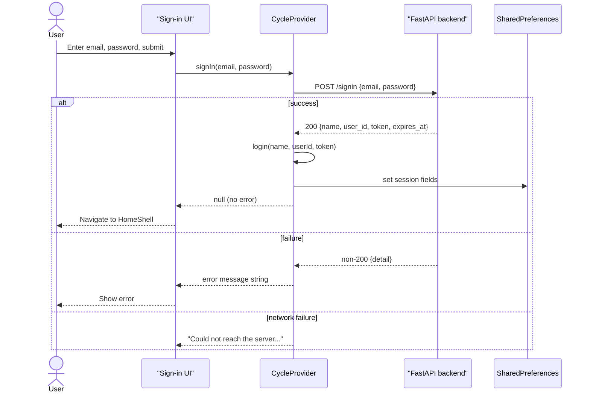

# Wellness Saheli — Mermaid Diagram Source

Standalone copies of every diagram from `WELLNESS_SAHELI_UML_DOCUMENTATION.md`,
so they can be pasted directly into any Mermaid renderer (mermaid.live,
VS Code Mermaid preview, GitHub/GitLab markdown, Notion, etc.) without hunting
through the full doc.

---

## 1. Use Case Overview

```mermaid
flowchart TB
    User((User))

    subgraph Account
        UC1[Sign Up]
        UC2[Sign In]
        UC3[Reset Password]
        UC4[Log Out]
    end

    subgraph Cycle
        UC5[Log Period Start/End]
        UC6[Log Mood]
        UC7[Log Symptoms]
        UC8[Log Flow Intensity]
        UC9[View Cycle Dial & Phase Insight]
    end

    subgraph PCOS
        UC10[Read PCOS Information Guide]
        UC11[Run PCOS Detection Form]
        UC12[View PCOS Result & History]
    end

    subgraph Protection
        UC13[Browse Contraception Methods]
        UC14[Run Eligibility Check]
        UC15[Save "I'm using this method"]
        UC16[View Additional Info: EC, Effectiveness, ARV glossary]
    end

    subgraph Diary
        UC17[Write Free-text Diary Entry]
        UC18[Log Wellness Check-in mood/stress]
        UC19[View Unified Health Timeline]
        UC20[View Profile Summary]
    end

    subgraph AICompanion
        UC21[Quick Check-in — select concerns]
        UC22[Receive tab suggestion PCOS/Protection/Mood]
        UC23[Converse with AI Companion]
    end

    subgraph Privacy
        UC24[Toggle AI Memory / Diary Access]
        UC25[Clear AI Memory / Delete Diary]
    end

    User --> UC1
    User --> UC2
    User --> UC3
    User --> UC4
    User --> UC5
    User --> UC6
    User --> UC7
    User --> UC8
    User --> UC9
    User --> UC10
    User --> UC11
    User --> UC12
    User --> UC13
    User --> UC14
    User --> UC15
    User --> UC16
    User --> UC17
    User --> UC18
    User --> UC19
    User --> UC20
    User --> UC21
    User --> UC22
    User --> UC23
    User --> UC24
    User --> UC25

    UC11 -.uses.-> PCOSAPI[(PCOS Prediction API)]
    UC14 -.uses.-> ELIGAPI[(Eligibility API)]
    UC1 -.uses.-> AUTHAPI[(Auth Backend)]
    UC2 -.uses.-> AUTHAPI
    UC3 -.uses.-> AUTHAPI
     UC23 -.uses.-> AIAPI[(AI/LLM Backend)]
```

---

## 2. Class Diagram — Data Model Layer



---

## 3. Screen / Widget Relationship Diagram



---

## 4. Sequence Diagram — PCOS Detection → Diary Timeline



---

## 5. Sequence Diagram — Eligibility Check → Fire-and-Forget Diary Logging

```mermaid
sequenceDiagram
    actor User
    participant ProtectionScreen
    participant EligibilityApiService
    participant ELIGAPI as Eligibility API
    participant HealthProfileService

    User->>ProtectionScreen: Select conditions, tap "Check my eligibility"
    ProtectionScreen->>ProtectionScreen: Filter to backend-known condition IDs
    alt no valid IDs
        ProtectionScreen-->>User: Inline error: "not supported yet"
    else valid IDs present
        ProtectionScreen->>EligibilityApiService: checkEligibility(validIds)
        EligibilityApiService->>ELIGAPI: HTTP request
        ELIGAPI-->>EligibilityApiService: List of MethodResult (method, category)
        EligibilityApiService-->>ProtectionScreen: List~MethodResult~
        ProtectionScreen->>User: Render result cards (color-coded by category)
        par fire-and-forget, does not block UI
            ProtectionScreen->>HealthProfileService: updateProfile(append ContraceptionLogEntry per result)
            HealthProfileService-->>ProtectionScreen: (silent; errors swallowed)
        end
        ProtectionScreen->>User: Show "How are you feeling about these results?" button
    end
```

---

## 6. Sequence Diagram — Diary Entry: Write and Persist



---

## 7. Sequence Diagram — AI Check-in: Concern Selection → Tab Suggestion



---

## 8. Sequence Diagram — Authentication (Sign In)


