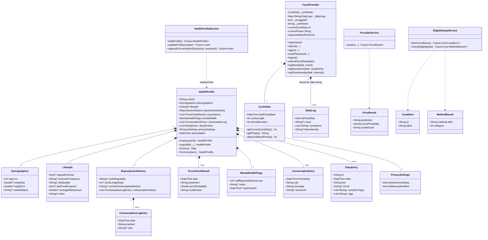
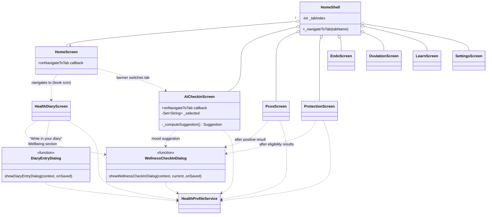
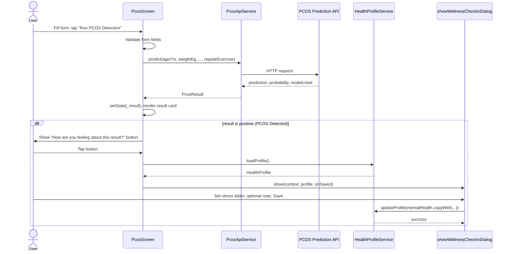
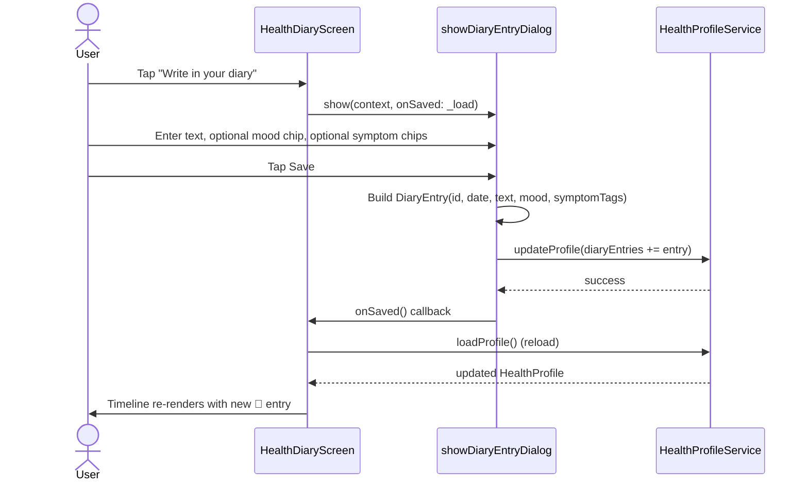
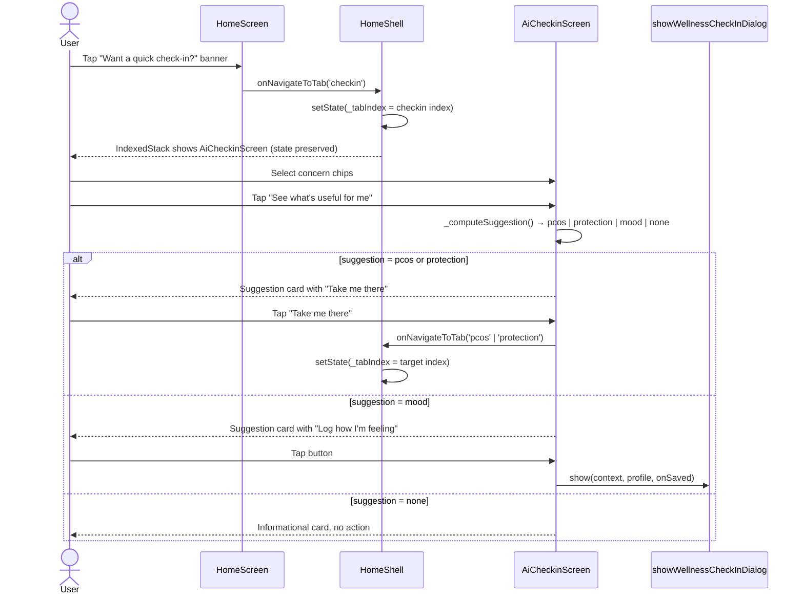
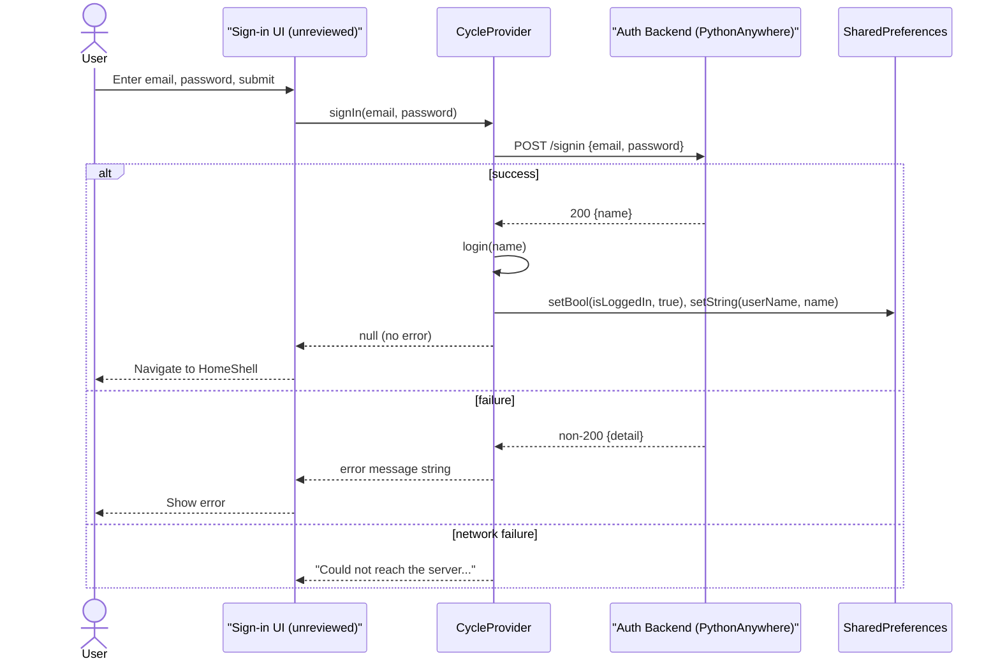

# Wellness Saheli — System Design Documentation
### Use Cases, Class (UML) Diagram, and Sequence Diagrams

> **Scope note:** This document is built from the parts of the codebase reviewed and
> built during development so far — the health profile data model, the PCOS,
> Protection, Diary, Home, Home Shell, and AI Check-in screens, the wellness
> check-in and diary-entry dialogs, and the Cycle provider. Screens/services not
> yet reviewed in detail (e.g. `ovulation_screen.dart`, `learn_screen.dart`,
> `settings_screen.dart` / `data_privacy_screen.dart`, `eligibility_api_service.dart`
> internals, `pcos_api_service.dart` internals) are represented at the level of
> detail currently known and marked accordingly. Update this document as those
> files are finalized.

---

## 1. Actors

| Actor | Description |
|---|---|
| **User** | The primary actor — a person using the app to track her cycle, check symptoms, manage contraception, journal, and talk to the AI companion. |
| **PCOS Prediction API** | External backend service (`PcosApiService`) that scores a set of clinical inputs and returns a PCOS likelihood. |
| **Eligibility API** | External backend service (`EligibilityApiService`) that returns WHO-MEC-style contraceptive eligibility categories (1–4) for a set of selected medical conditions. |
| **Auth/Account Backend** | External REST backend (PythonAnywhere) handling sign up, sign in, and password reset. |
| **AI / LLM Backend** | *(Planned / in progress)* — the conversational layer behind the AI Check-in screen; assembles context and returns companion responses. |

---

## 2. Use Case Overview

```mermaid
flowchart TB
    User((User))

    subgraph Account
        UC1[Sign Up]
        UC2[Sign In]
        UC3[Reset Password]
        UC4[Log Out]
    end

    subgraph Cycle
        UC5[Log Period Start/End]
        UC6[Log Mood]
        UC7[Log Symptoms]
        UC8[Log Flow Intensity]
        UC9[View Cycle Dial & Phase Insight]
    end

    subgraph PCOS
        UC10[Read PCOS Information Guide]
        UC11[Run PCOS Detection Form]
        UC12[View PCOS Result & History]
    end

    subgraph Protection
        UC13[Browse Contraception Methods]
        UC14[Run Eligibility Check]
        UC15[Save "I'm using this method"]
        UC16[View Additional Info: EC, Effectiveness, ARV glossary]
    end

    subgraph Diary
        UC17[Write Free-text Diary Entry]
        UC18[Log Wellness Check-in mood/stress]
        UC19[View Unified Health Timeline]
        UC20[View Profile Summary]
    end

    subgraph AICompanion
        UC21[Quick Check-in — select concerns]
        UC22[Receive tab suggestion PCOS/Protection/Mood]
        UC23[Converse with AI Companion - planned]
    end

    subgraph Privacy
        UC24[Toggle AI Memory / Diary Access - planned]
        UC25[Clear AI Memory / Delete Diary - planned]
    end

    User --> UC1
    User --> UC2
    User --> UC3
    User --> UC4
    User --> UC5
    User --> UC6
    User --> UC7
    User --> UC8
    User --> UC9
    User --> UC10
    User --> UC11
    User --> UC12
    User --> UC13
    User --> UC14
    User --> UC15
    User --> UC16
    User --> UC17
    User --> UC18
    User --> UC19
    User --> UC20
    User --> UC21
    User --> UC22
    User --> UC23
    User --> UC24
    User --> UC25

    UC11 -.uses.-> PCOSAPI[(PCOS Prediction API)]
    UC14 -.uses.-> ELIGAPI[(Eligibility API)]
    UC1 -.uses.-> AUTHAPI[(Auth Backend)]
    UC2 -.uses.-> AUTHAPI
    UC3 -.uses.-> AUTHAPI
    UC23 -.uses.-> AIAPI[(AI/LLM Backend - planned)]
```

### 2.1 Use Case Descriptions (selected, high-value flows)

#### UC11 — Run PCOS Detection Form
- **Actor:** User
- **Precondition:** User is on the PCOS tab → Detection sub-tab.
- **Main flow:**
  1. User fills in personal, hormonal/lab, blood pressure, ultrasound, and symptom/lifestyle fields.
  2. User taps "Run PCOS Detection".
  3. App validates all fields via `Form` validators.
  4. App calls `PcosApiService.predict(...)`.
  5. API returns prediction, probability, and model used.
  6. Result is rendered in `_resultCard`; if positive, a "How are you feeling about this result?" wellness check-in prompt is shown.
  7. Result is persisted to `HealthProfile.pcosHistory` (implied by the Diary's PCOS-check counter reading this list).
- **Alternate flow:** API call fails → error text shown, no result card rendered.

#### UC14 — Run Eligibility Check
- **Actor:** User
- **Precondition:** User is on Protection → My Plan → Eligibility tool.
- **Main flow:**
  1. User sets an age-preference slider and selects one or more medical conditions from a grouped/nested condition tree (only conditions confirmed present in `_apiConditionIds` are selectable — others show a "Coming soon" badge).
  2. User taps "Check my eligibility".
  3. App filters selections to only backend-known IDs; if none are valid, shows an inline error.
  4. App calls `EligibilityApiService.checkEligibility(validIds)`.
  5. Results (method, category 1–4) are rendered as result cards, color-coded by category.
  6. **Fire-and-forget:** results are also appended to `HealthProfile.reproductiveHistory.contraceptionHistory` as `ContraceptionLogEntry` records tagged `"Eligibility check — ..."`, distinguishing them from manually-selected methods.
  7. A "How are you feeling about these results?" wellness check-in prompt appears below the results.

#### UC17 — Write Free-text Diary Entry
- **Actor:** User
- **Precondition:** User is on the Diary screen.
- **Main flow:**
  1. User taps "Write in your diary".
  2. `showDiaryEntryDialog` opens: free text field, optional mood chip, optional symptom-tag chips.
  3. User taps Save (disabled until text is non-empty).
  4. A `DiaryEntry` is constructed and appended to `HealthProfile.diaryEntries` via `HealthProfileService.updateProfile`.
  5. Diary screen reloads; entry appears in the unified Timeline tagged with a 📝 icon.

#### UC21/UC22 — AI Quick Check-in and Suggestion
- **Actor:** User
- **Precondition:** User opens the "Check-in" tab (or taps the dismissible Home banner, which switches to that tab).
- **Main flow:**
  1. User selects one or more concern chips (PCOS-related, Protection-related, mood-related, or "nothing in particular").
  2. User taps "See what's useful for me".
  3. `_computeSuggestion()` scores selections by category and returns the highest-priority match (PCOS ≥ Protection ≥ Mood ≥ None).
  4. A suggestion card renders with a call-to-action:
     - PCOS/Protection → "Take me there" switches the Home Shell's selected bottom-nav tab via `onNavigateToTab`.
     - Mood → "Log how I'm feeling" opens the shared wellness check-in dialog.
     - None → informational card only, no action button.
  5. User may tap "Start over" to reset and re-answer.

> **Note:** This is currently a **rule-based chip selector**, not a free-form conversational AI. UC23 (true LLM conversation with memory) is the planned next phase and is not yet implemented — see the companion setup guide's "Known Gaps / Next Phases" section.

---

## 3. Class Diagram (Data Model Layer)

This reflects `lib/models/health_profile.dart`, `lib/models/cycle_data.dart` /
`daily_log.dart` (referenced, not fully reviewed), and the screen-local models
used by PCOS/Protection.



> **Note on `ConversationEntry.sessionId`:** added to support a chat-history /
> sessions feature (multiple distinct AI conversations per user, not one
> unbroken log). `HealthProfileService.appendConversationEntry()` now accepts
> an optional `sessionId` to tag entries accordingly.

> **Note on `PrivacySettings`:** governs *permission*, not deletion. Turning
> `aiCanAccessDiary` off does not erase `diaryEntries` — it only instructs the
> (planned) AI context-assembly layer to skip them. Actual deletion is a
> separate, explicit user action to be wired in Settings / Data Privacy.

---

## 4. Screen / Widget Relationship Diagram



---

## 5. Sequence Diagrams

### 5.1 PCOS Detection → Diary Timeline



### 5.2 Eligibility Check → Fire-and-Forget Diary Logging

```mermaid
sequenceDiagram
    actor User
    participant ProtectionScreen
    participant EligibilityApiService
    participant ELIGAPI as Eligibility API
    participant HealthProfileService

    User->>ProtectionScreen: Select conditions, tap "Check my eligibility"
    ProtectionScreen->>ProtectionScreen: Filter to backend-known condition IDs
    alt no valid IDs
        ProtectionScreen-->>User: Inline error: "not supported yet"
    else valid IDs present
        ProtectionScreen->>EligibilityApiService: checkEligibility(validIds)
        EligibilityApiService->>ELIGAPI: HTTP request
        ELIGAPI-->>EligibilityApiService: List of MethodResult (method, category)
        EligibilityApiService-->>ProtectionScreen: List~MethodResult~
        ProtectionScreen->>User: Render result cards (color-coded by category)
        par fire-and-forget, does not block UI
            ProtectionScreen->>HealthProfileService: updateProfile(append ContraceptionLogEntry per result)
            HealthProfileService-->>ProtectionScreen: (silent; errors swallowed)
        end
        ProtectionScreen->>User: Show "How are you feeling about these results?" button
    end
```

### 5.3 Diary Entry — Write and Persist



### 5.4 AI Check-in — Concern Selection → Tab Suggestion



### 5.5 Authentication (Sign In)



---

## 6. Known Gaps to Reflect in Future Revisions of This Document

- **`ai_checkin_screen.dart`** as currently documented (§2 UC21/22) is the
  chip-based version. A referenced later iteration adds `sessionId`-tagged
  conversation entries (see `ConversationEntry.sessionId` in §3), implying a
  richer chat UI is being built — once that lands, §2 UC23 and §5.4 should be
  rewritten as a full conversational sequence diagram (user message → context
  assembly → LLM call → safety check → response → persisted turn).
- **`data_privacy_screen.dart`** (Settings) was referenced as the presumed
  consumer of `PrivacySettings` but not yet reviewed — once available, add a
  use case + sequence diagram for toggling AI memory / diary access and for
  "clear AI memory" / "delete diary entries" actions.
- **`endo_screen.dart` Detection tab** is currently a placeholder (no form, no
  persistence) — intentionally deferred per product decision. Add its use
  case and sequence diagram once built, modeled after §5.1 but with symptom
  questions instead of lab values, per product-brief guidance for
  Endometriosis (non-diagnostic risk/concern level only).
- **`ovulation_screen.dart`**, **`learn_screen.dart`** — not yet reviewed;
  add to §2 and §4 once inspected.
- **AI/LLM backend** — not yet implemented; §1 and the sequence diagrams mark
  it as "planned."
